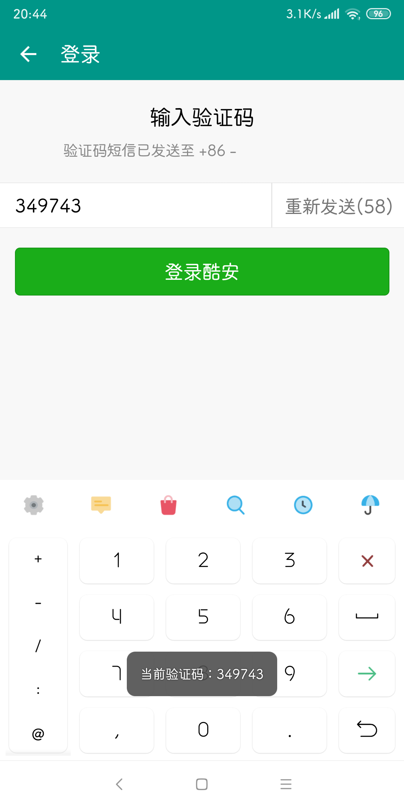
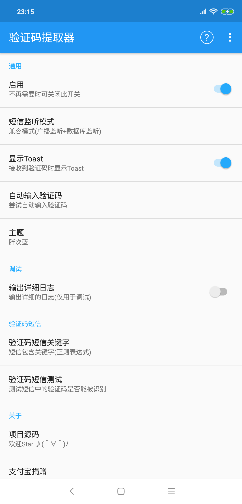
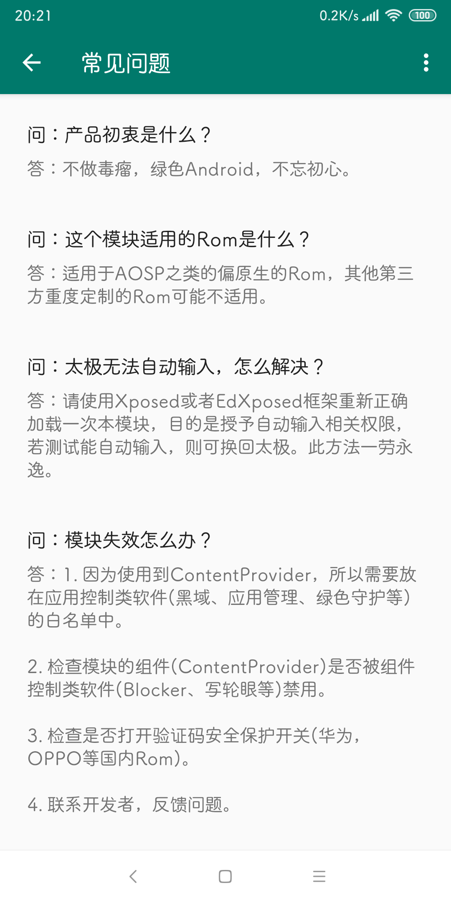
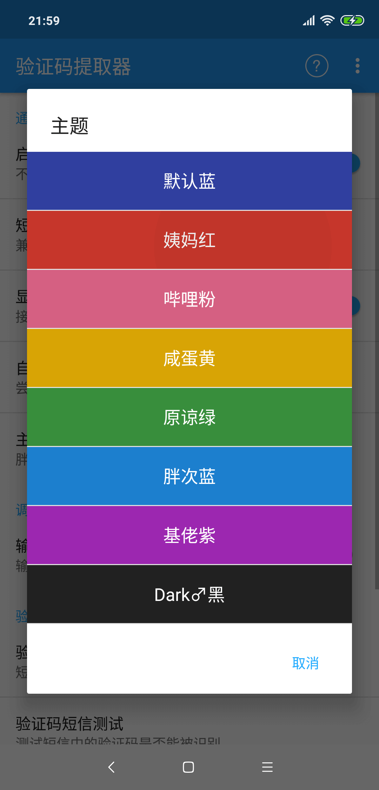

# XposedSmsCode
识别短信验证码的Xposed模块，并将验证码拷贝到剪切板，亦可以自动输入验证码。

[English README](/README-EN.md)

# 应用截图

可以在 [Xposed仓库](http://repo.xposed.info/module/com.github.tianma8023.xposed.smscode) 或者 [酷安](https://www.coolapk.com/apk/com.github.tianma8023.xposed.smscode) 下载此模块。

# 使用
1. Root你的设备，安装Xposed框架；
2. 安装本模块，激活并重启；
3. Enjoy it！

欢迎反馈，欢迎提出意见或建议。

# 注意
- **此模块适用于偏原生的系统，其他第三方定制Rom可能不适用。**
- **兼容性：兼容 Android 5.0 及以上（api等级≥21）设备。**
- **遇到什么问题请先阅读模块中的"常见问题"**

# 功能
- 收到验证码短信后将验证码复制到系统剪贴板
- 当验证码被复制后显示Toast
- 将验证码短信标记为已读（实验性）
- 删除验证码短信（实验性）
- 自定义验证码短信关键字（正则表达式）
- 自定义验证码匹配规则，并支持规则导入导出
- 自动输入验证码
- 主题换肤

# 更新日志
[更新日志](/LOG-CN.md)

# 感谢
- [NekoSMS](https://github.com/apsun/NekoSMS)
- [SmsCodeHelper](https://github.com/drakeet/SmsCodeHelper)
- [ButterKnife](https://github.com/JakeWharton/butterknife)
- [Remote Preferences](https://github.com/apsun/RemotePreferences)
- [Material Dialogs](https://github.com/afollestad/material-dialogs)
- [Android Shell](https://github.com/jaredrummler/AndroidShell)

# 协议
所有的源码均遵循 [GPLv3](https://www.gnu.org/licenses/gpl-3.0.txt) 协议