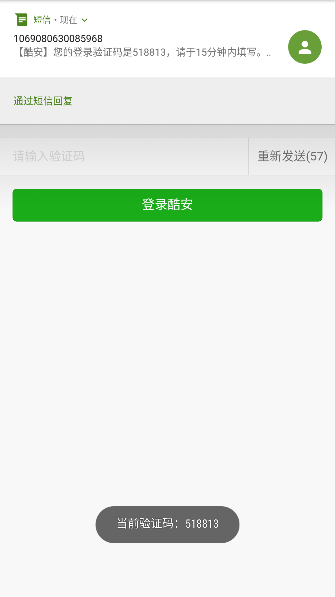
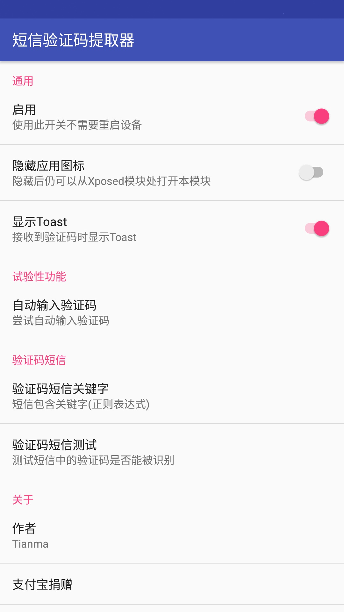
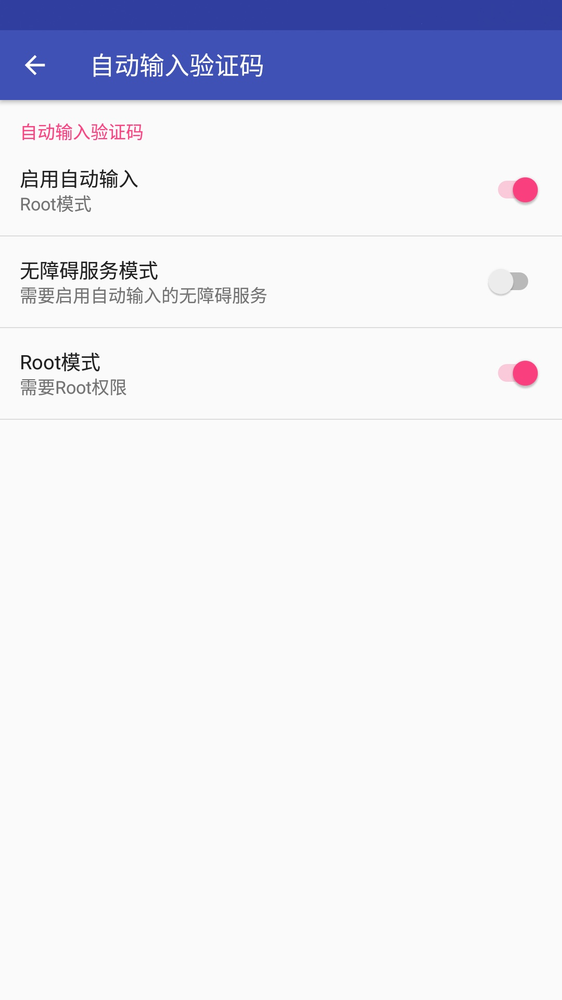
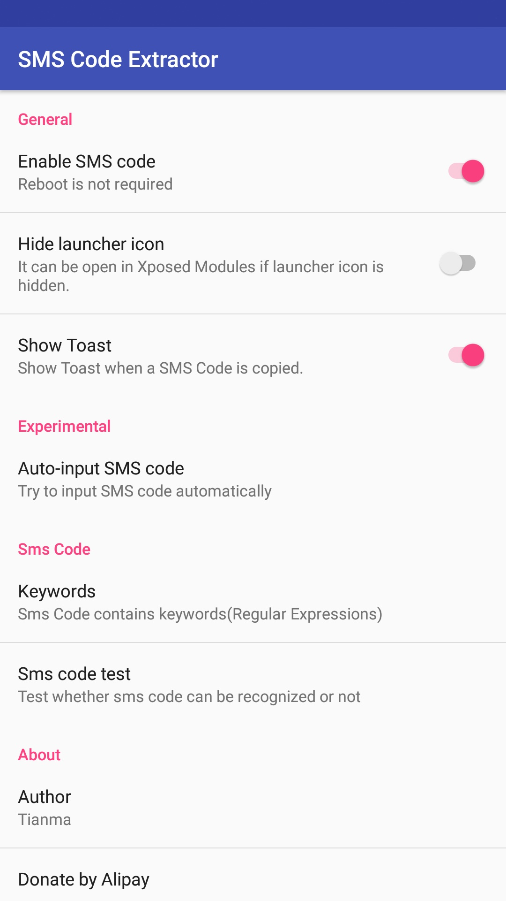
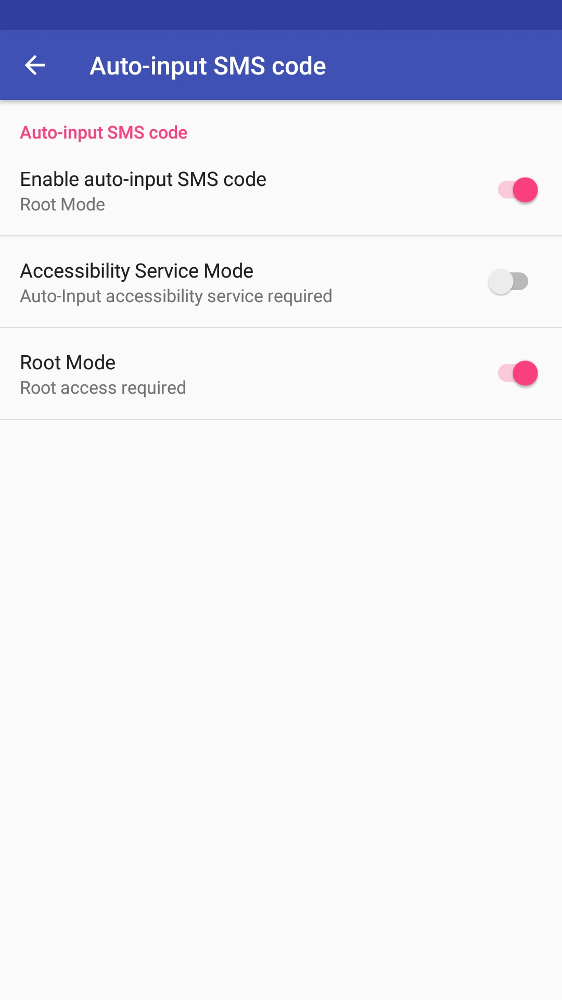

# XposedSmsCode
识别短信验证码的Xposed模块，并将验证码拷贝到剪切板，亦可以自动输入验证码。

[English README](/README-EN.md)

可以在 [Xposed仓库](http://repo.xposed.info/module/com.github.tianma8023.xposed.smscode) 或者 [酷安](https://www.coolapk.com/apk/com.github.tianma8023.xposed.smscode) 下载此模块。

# 使用
1. Root你的设备，安装Xposed框架；
2. 安装本模块，激活并重启；
3. 玩耍愉快！

欢迎反馈，欢迎提出意见或建议。

# 注意
**此模块适用于偏原生的系统，其他第三方定制Rom可能不适用。**

**兼容性：兼容 Android 4.4及以上（api等级≥19）设备。**

# 功能
- 收到验证码短信后将验证码复制到系统剪贴板
- 当验证码被复制后显示Toast
- <s>将验证码短信标记为已读（实验性）</s>
- 自定义验证码短信关键字（正则表达式）
- 自动输入验证码

# 更新日志
- 18.09.02 v1.4.5
  1. 修改App名字
  2. 修复短信验证码中包含小数会解析出错误验证码的BUG
- 18.08.31 v1.4.4
  1. 优化英文短信验证码识别算法
  2. 修复无障碍模式以及手动对焦模式下无法自动输入的BUG
  3. 更新FAQ
- 18.08.20 v1.4.3
  1. 新增功能：两种对焦模式（自动对焦和手动对焦）
  2. 补充完善FAQ
- 18.08.16 v1.4.2
  1. 新增功能：进QQ群反馈交流入口
  2. 补充完善FAQ
- 18.08.15 v1.4.1
  1. 修复BUG：在第三方App未启用的情况下，打开第三方App的空指针异常。
- 18.08.14 v1.4.0
  1. 优化验证码识别算法，提高识别率。
  2. 新加入主题功能
- 18.08.06 v1.3.0
  1. 修复Android 6.0及以下包含自动输入在内的问题
  2. 优化自动输入验证码策略
  3. 加入繁体中文
  4. 添加FAQ（英文版本的没翻译，求翻译w(ﾟДﾟ)w）
  5. 加入调试开关，用以输出log到Xposed（仅调试用）
- 18.07.26 v1.2.1
  1. 优化自动输入的策略
- 18.07.25 v1.2.0
  1. 移除标记为已读功能
  2. 增加短信验证码自动输入功能
  3. 集成友盟统计
- 18.07.11 v1.1.1
  1. Bug fix: Can't create handler inside thread that has not called Looper.prepare().
  2. Bug fix: test-only package cannot be installed
- 18.06.26 v1.0.1 
  1. 自定义短信验证码关键字的正则表达式规则
  2. 添加规则测试功能
- 18.05.27 v0.0.1 
  1. 添加基本功能

# 感谢
- [NekoSMS](https://github.com/apsun/NekoSMS)
- [SmsCodeHelper](https://github.com/drakeet/SmsCodeHelper)
- [ButterKnife](https://github.com/JakeWharton/butterknife)
- [Remote Preferences](https://github.com/apsun/RemotePreferences)
- [Material Dialogs](https://github.com/afollestad/material-dialogs)
- [Android Shell](https://github.com/jaredrummler/AndroidShell)

# 协议
所有的源码均遵循 [GPLv3](https://www.gnu.org/licenses/gpl-3.0.txt) 协议