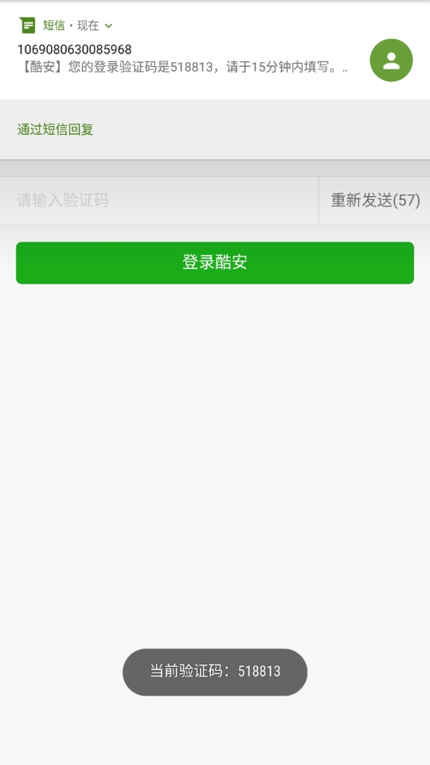

# XposedSmsCode
A Xposed Module which can recognize ,parse verification code and copy it to clipboard when a new message arrives. / 识别短信验证码的Xposed模块，并将验证码拷贝到剪切板。

# Usage / 使用
1. Root your device and install Xposed Framework. / Root你的设备，安装Xposed框架
2. Install and activite this xposed module and reboot. / 安装本模块，激活并重启
3. Have fun!

Welcome any feedbacks. / 欢迎反馈，欢迎提出意见或建议。

# Thanks / 感谢
- [NekoSMS](https://github.com/apsun/NekoSMS)
- [SmsCodeHelper](https://github.com/drakeet/SmsCodeHelper)

# License / 协议
All code is licensed under [GPLv3](https://www.gnu.org/licenses/gpl-3.0.txt) 